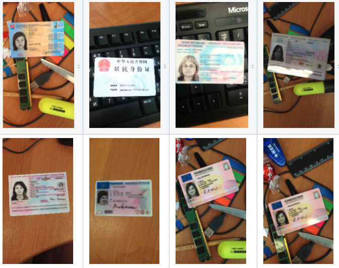
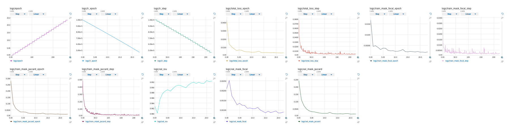
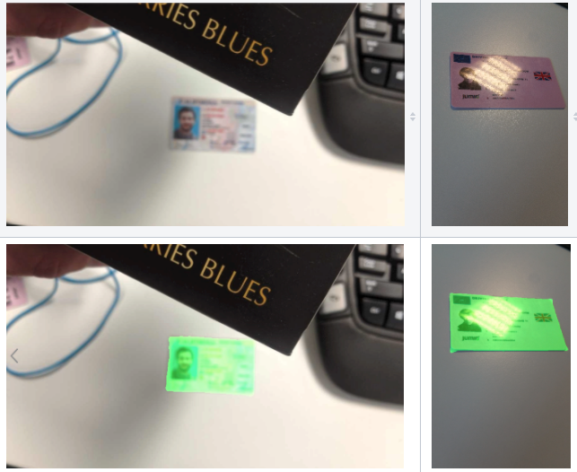

# card_edge_segmentation

The repository contains a model for semantic segmentation of the documents.

## Dataset

Model is trained on MIDV-500: [A Dataset for Identity Documents Analysis and Recognition on Mobile Devices in Video Stream](https://arxiv.org/abs/1807.05786).

## Training
`python midv500models/train.py -c midv500models/configs/2021-05-14.yaml \
                              -i <path to train>`

`python midv500models/inference.py -c midv500models/configs/2021-05-14.yaml \
                                  -i <path to images> \
                                  -o <path to save preidctions>
                                  -w <path to weights>`

Example of training images

## Experiment Setup

Experiment Setup:

Model: Unet with Resnet34 backbone, encoder weights were pretrained on the Imagenet.

Optimizer: AdamW

Initial learning rate: 0.0001

Learning Rate Scheduler: PolyLR, for maximum iteration of 40 

Gradient clipping is applied

The model is trained with total of 23 epochs, the model can be further trained as it has not reach overfitting phrase.

Training and Validating batch_size :32

We save the best weight based on the best validation IOU.

Losses: Jaccard loss with binary mode and focal loss.

The model is train on p3.x2large machine with 1 GPU.

## Augmentation at training time:

- Normalized with mean (0.485, 0.456,0.406) and std (0.229,0.224,0.225)
- HorizontalFlip
- RandomBrightnessContrast
- RandomGamma
- HueSaturationValue
- Blur
- JpegCompression
- RandomRotate90
- Augmentation at validation time:
- LongestMaxSize
- PadIfNeeded
- Normalized with mean (0.485, 0.456,0.406) and std (0.229,0.224,0.225)
- At training time, the augmentation has been set to probability of 0.5, while transformation at validating time has been set to probability of 1.

## Augmentation at inference time:

- Normalized with mean (0.485, 0.456,0.406) and std (0.229,0.224,0.225)

## Training Curve

## Inference results

The model is able to generalize well with test images, which are completely different from the training images.

## Reference

https://github.com/ternaus/midv-500-models